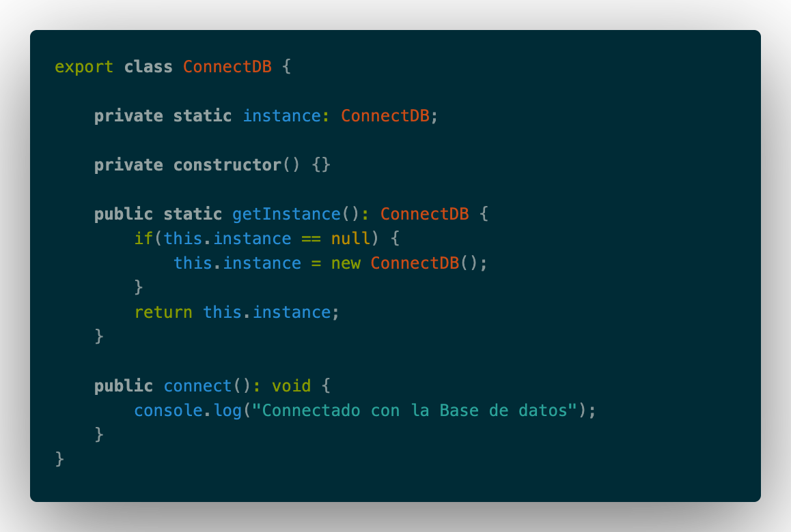
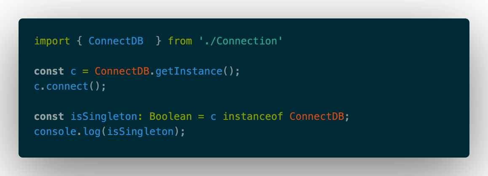

# Singleton

El objetivo del patrón singleton, es tener una única instancia de una clase, mientras nuestra aplicacion esta corriendo.

Porque se usa? para evitar cargar objetos que contienen la misma informacion multiples veces. Es decir que instancia una sola vez al inicio de la aplicacion y la instancia se expone para ser usada. 

Ejemplo: Supongamos que tenemos una clase que se encarga de de una lista de paises, es algo muy remoto que cambie algun nombre de un pais, casi imposible, Si no usaramos singleton tuvieramos multiples instancias cada vez que se requiera la lista de paises, y sobre uso de la memoria.

**Desventaja**: El abuso de este patron puede provocar errores en ciertos casos.

Un ejemplo en Typescript y el mas comun de los ejemplos, es usar Singleton para conectarnos a una base de datos. Ejemplo



Recapitulando las cosas:

1. Nuestra Clase debe tener el atributo para guardar su propia instancia.
2. Su constructor debe estar privado (No accesible para evitar el new).
3. Creamos un metodo publico estatico para acceder a la instancia. (Entry point).

Con esto tenemos que nuestra Clase singleton, cuando es invocada retornara su propia instancia, si no existe ninguna la creara.

Invocacion:



```bash
ts-node index.ts
Connectado con la Base de datos
true
```

Podemos observar que:

1. No necesitamos instancia nuestra clase con el operador new. Sino que lo obtenemos a traves del entry point.
2. Podemos hacer la prueba de que nuestra clase es singleton, preguntando si c es una instancia de nuestra clase.